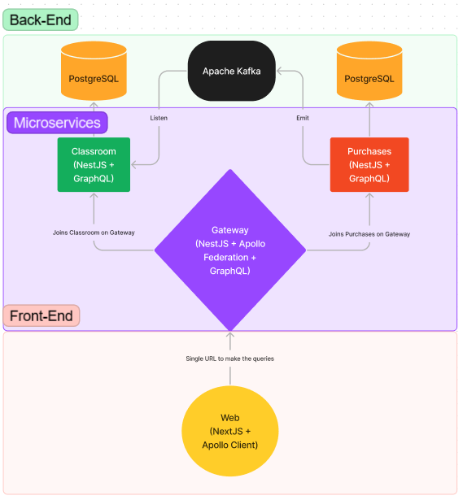

<h1 align="center" justify="center">
  
  TechLound
</h1>

<p align="center">
  <a href="#description">Description</a>&nbsp;&nbsp;&nbsp;|&nbsp;&nbsp;&nbsp;
  <a href="#requirements">Requirements</a>&nbsp;&nbsp;&nbsp;|&nbsp;&nbsp;&nbsp;
  <a href="#technologies">Technologies</a>&nbsp;&nbsp;&nbsp;|&nbsp;&nbsp;&nbsp;
  <a href="#usage">Usage</a></a>&nbsp;&nbsp;&nbsp;|&nbsp;&nbsp;&nbsp;
  <a href="#demonstration">Demonstration</a>
</p>
<br />
<p align="center">
  
  
  
  
  
  
  
</p>

<p align="center">
  <a href="https://github.com/Lissone/tech-lound/issues">Report bug</a>
  ·
  <a href="https://github.com/Lissone/tech-lound/issues">Request feature</a>
</p>

<br />

## Description

Project to register expenses and deposit, as a way to control and report the progress of your finances.

At the moment working only with a fake api, to improve the learning of present technologies.



## Requirements

- [Nodejs](https://nodejs.org/en/)
- [Docker](https://www.docker.com/)
- [Npm](https://www.npmjs.com/)
- [Yarn](https://yarnpkg.com/)

## Technologies

- Yarn Workspaces
- Typescript
- NestJs
- GraphQL
- Apollo Federation (Gateway)
- Apache Kafka
- Prisma
- PostgreSQL
- Next.js
- Auth0
- Apollo Client
- Codegen
- TailwindCss
- Eslint
  - Airbnb-config with another pessoal rules
  - Import helpers plugin
- Prettier
- Commitlint
  - Commitizen

### Docker

```bash
# Sobe containers
docker-compose up -d
# Derruba containers
docker-compose down
# Visualiza todos os containers rodando
docker ps
```

### Prisma

```bash
# Cria referencia do Prisma Client pelo node_modules
npx prisma generate
# Cria migration de acordo com schema
npx prisma migrate dev
# Inicia servidor de studio do prisma
yarn prisma-studio
```

## Usage

You can clone it on your pc using the command:

```bash
git clone https://github.com/Lissone/tech-lound.git
cd tech-lound
```

Install dependencies using:

```bash
yarn
#or
npm install
```

Run web:

```bash
yarn dev
#or
npm run dev
```

## Demonstration

**Dashboard**


## License

Distributed under the MIT License. See `LICENSE` for more information.

<h4 align="center">
  Made with ❤️ by <a href="https://github.com/Lissone" target="_blank">Lissone</a>
</h4>

<hr />
